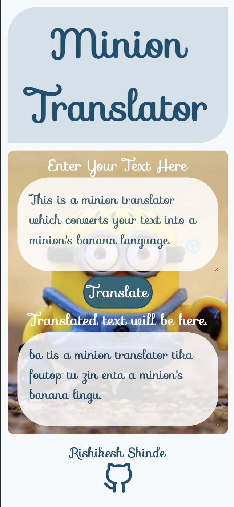

# **Minion Translator**

This is a minion fun translation app based on [Fun Translation API](https://funtranslations.com/api/) .
Server URL used for getting translations is:

    https://api.funtranslations.com/translate/"+'minion'+".json"

> ### What is special about this app?

1. This app is build using only `HTML` , `CSS` , `Javscript` .

2. It looks pretty on mobile phone also.

How it looks on mobile phone? Let's see:

3. This is not about app 😉 , but minion translations are really funny.

> ### Where do I can have a fun of this app?

You can visit this app by clicking [here](https://minion-fun-translations.netlify.app/) .

Enjoy!
